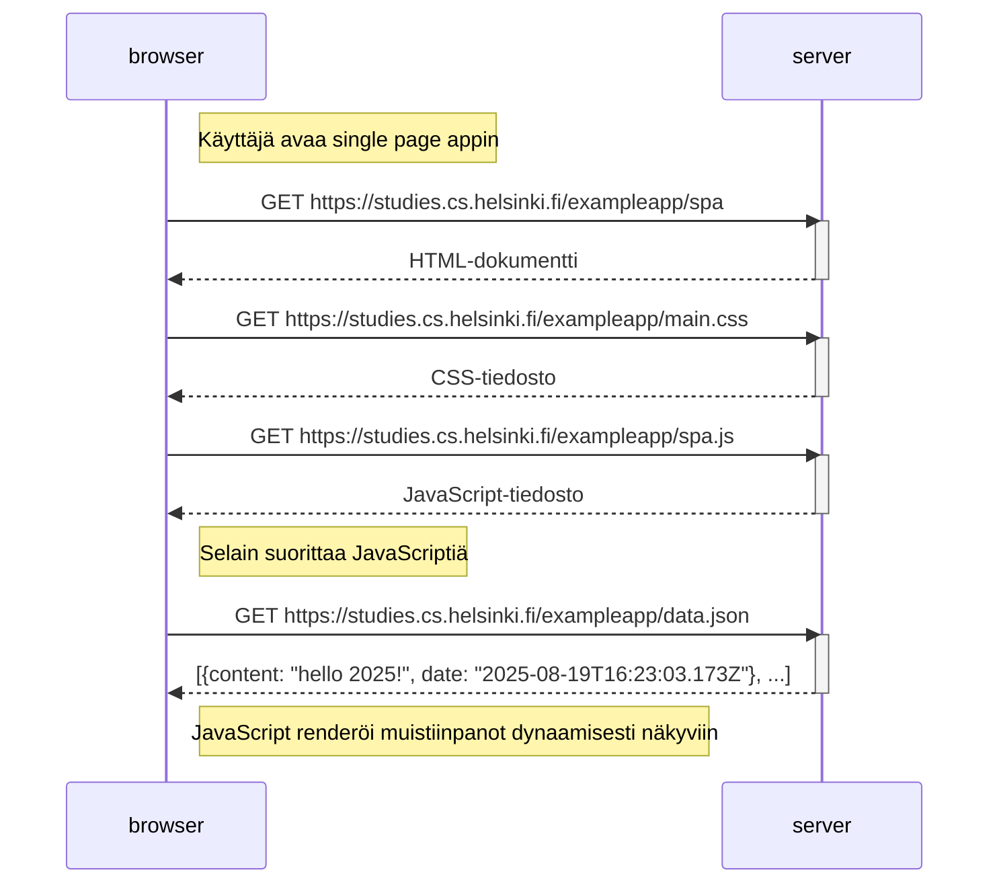

```mermaid
sequenceDiagram
    participant browser
    participant server

    Note right of browser: Käyttäjä avaa single page appin

    browser->>server: GET https://studies.cs.helsinki.fi/exampleapp/spa 
    activate server
    server-->>browser: HTML-dokumentti
    deactivate server

    browser->>server: GET https://studies.cs.helsinki.fi/exampleapp/main.css 
    activate server
    server-->>browser: CSS-tiedosto
    deactivate server

    browser->>server: GET https://studies.cs.helsinki.fi/exampleapp/spa.js 
    activate server
    server-->>browser: JavaScript-tiedosto
    deactivate server

    Note right of browser: Selain suorittaa JavaScriptiä

    browser->>server: GET https://studies.cs.helsinki.fi/exampleapp/data.json 
    activate server
    server-->>browser: [{content: "hello 2025!", date: "2025-08-19T16:23:03.173Z"}, ...]
    deactivate server

    Note right of browser: JavaScript renderöi muistiinpanot dynaamisesti näkyviin

```