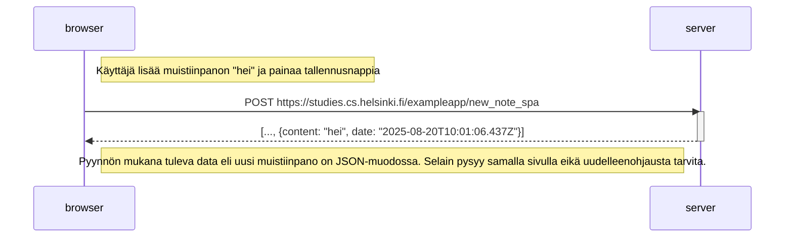

```mermaid
sequenceDiagram
    participant browser
    participant server

    Note right of browser: Käyttäjä lisää muistiinpanon "hei" ja painaa tallennusnappia

    browser->>server: POST https://studies.cs.helsinki.fi/exampleapp/new_note_spa 
    activate server
    server-->>browser: [..., {content: "hei", date: "2025-08-20T10:01:06.437Z"}]
    deactivate server

    Note right of browser: Pyynnön mukana tuleva data eli uusi muistiinpano on JSON-muodossa. Selain pysyy samalla sivulla eikä uudelleenohjausta tarvita.
```